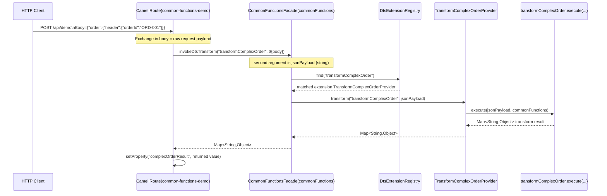

# 24 Third-Party DTS Extension Minimal Template (Copy-Ready)

## 1. Goal

This document provides a copy-ready minimal template to help third-party teams complete, within 10-20 minutes:

- Create a new DTS extension project
- Implement one `transformName`
- Package and deploy to `services/TransformDS`
- Call and verify it in a route

---

## 2. Directory Structure (recommended)

```text
your-dts-impl/
  pom.xml
  src/main/java/com/yourcompany/lightesb/dts/spi/OrderRiskProvider.java
  src/main/resources/META-INF/services/com.oureman.soa.lightesb.core.dts.spi.LightesbDtsExtension
```

---

## 3. Minimal `pom.xml` Template

> Note: To keep third-party projects dependent only on essential capabilities, this template only includes `jackson-databind` and compiler plugin.  
> If your team already uses internal SDK/BOM, replace dependencies according to your dependency governance rules.

```xml
<?xml version="1.0" encoding="UTF-8"?>
<project xmlns="http://maven.apache.org/POM/4.0.0"
         xmlns:xsi="http://www.w3.org/2001/XMLSchema-instance"
         xsi:schemaLocation="http://maven.apache.org/POM/4.0.0 https://maven.apache.org/xsd/maven-4.0.0.xsd">
    <modelVersion>4.0.0</modelVersion>

    <groupId>com.yourcompany.lightesb</groupId>
    <artifactId>order-dts-impl</artifactId>
    <version>1.0.0</version>
    <packaging>jar</packaging>

    <properties>
        <maven.compiler.release>21</maven.compiler.release>
        <project.build.sourceEncoding>UTF-8</project.build.sourceEncoding>
    </properties>

    <dependencies>
        <dependency>
            <groupId>com.fasterxml.jackson.core</groupId>
            <artifactId>jackson-databind</artifactId>
            <version>2.17.2</version>
        </dependency>
    </dependencies>

    <build>
        <plugins>
            <plugin>
                <groupId>org.apache.maven.plugins</groupId>
                <artifactId>maven-compiler-plugin</artifactId>
                <version>3.13.0</version>
                <configuration>
                    <release>${maven.compiler.release}</release>
                    <encoding>${project.build.sourceEncoding}</encoding>
                </configuration>
            </plugin>
        </plugins>
    </build>
</project>
```

---

## 4. Minimal Provider Template

File: `src/main/java/com/yourcompany/lightesb/dts/spi/OrderRiskProvider.java`

```java
package com.yourcompany.lightesb.dts.spi;

import com.fasterxml.jackson.core.JsonProcessingException;
import com.fasterxml.jackson.databind.ObjectMapper;
import com.oureman.soa.lightesb.core.dts.spi.LightesbDtsExtension;

import java.util.LinkedHashMap;
import java.util.Map;
import java.util.Set;

public class OrderRiskProvider implements LightesbDtsExtension {

    private static final ObjectMapper OBJECT_MAPPER = new ObjectMapper();

    @Override
    public String id() {
        return "orderRiskProvider";
    }

    @Override
    public int priority() {
        return 100;
    }

    @Override
    public String version() {
        return "1.0.0";
    }

    @Override
    public Set<String> supportedTransforms() {
        return Set.of("transformOrderRisk");
    }

    @Override
    public Map<String, Object> transform(String transformName, String jsonPayload) {
        return transform(transformName, parseJsonToMap(jsonPayload));
    }

    @Override
    public Map<String, Object> transform(String transformName, Map<String, Object> payload) {
        if (!"transformOrderRisk".equals(transformName)) {
            throw new IllegalArgumentException("Unsupported transformName: " + transformName);
        }

        Map<String, Object> result = new LinkedHashMap<>();
        Object amount = get(payload, "order", "payment", "summary", "total");
        double total = toDouble(amount);
        result.put("transform", "transformOrderRisk");
        result.put("orderId", get(payload, "order", "header", "orderId"));
        result.put("total", total);
        result.put("riskLevel", total > 5000D ? "MEDIUM" : "LOW");
        return result;
    }

    @SuppressWarnings("unchecked")
    private Map<String, Object> parseJsonToMap(String jsonPayload) {
        if (jsonPayload == null || jsonPayload.isEmpty()) {
            return new LinkedHashMap<>();
        }
        try {
            return OBJECT_MAPPER.readValue(jsonPayload, Map.class);
        } catch (JsonProcessingException e) {
            throw new IllegalArgumentException("Invalid JSON payload: " + e.getMessage(), e);
        }
    }

    private double toDouble(Object value) {
        if (value instanceof Number number) {
            return number.doubleValue();
        }
        if (value == null) {
            return 0D;
        }
        try {
            return Double.parseDouble(value.toString());
        } catch (NumberFormatException e) {
            return 0D;
        }
    }

    @SuppressWarnings("unchecked")
    private Object get(Map<String, Object> map, String... path) {
        Object current = map;
        for (String key : path) {
            if (!(current instanceof Map<?, ?> currentMap)) {
                return null;
            }
            current = ((Map<String, Object>) currentMap).get(key);
            if (current == null) {
                return null;
            }
        }
        return current;
    }
}
```

---

## 5. SPI Descriptor File Template

File: `src/main/resources/META-INF/services/com.oureman.soa.lightesb.core.dts.spi.LightesbDtsExtension`

```text
com.yourcompany.lightesb.dts.spi.OrderRiskProvider
```

Notes:

- This must be the **fully qualified implementation class name**
- If multiple Providers exist, one class per line

---

## 6. Packaging and Deployment

### 6.1 Package

```bash
mvn clean package
```

Artifact example:

- `target/order-dts-impl-1.0.0.jar`

### 6.2 Deploy

Put the jar into:

- `services/TransformDS`

LightESB scans this directory by default (can be overridden by `lightesb.transformds.*` configuration).

---

## 7. Route Invocation Template

```xml
<setProperty name="orderRiskResult">
    <method ref="commonFunctions" method="invokeDtsTransform('transformOrderRisk', ${body})" />
</setProperty>
<to uri="servicelog:info?message=orderRiskResult: ${exchangeProperty.orderRiskResult}"/>
```

Notes:

- It is recommended to use unified entry `invokeDtsTransform('<transformName>', ...)`
- `transformName` must match the value returned by `supportedTransforms()`

---

## 8. Parameter Passing Sequence (Route to Provider)

Using `transformComplexOrder` as an example, this section explains full parameter flow from HTTP body to `TransformComplexOrderProvider.transform(..., jsonPayload)`.



Key points:

- `${body}` comes from current Camel `Exchange` message body, usually the HTTP request payload
- `method="invokeDtsTransform('transformComplexOrder', ${body})"` passes `${body}` as second argument
- This argument is named `jsonPayload` in `CommonFunctionsFacade`
- It is eventually passed into `TransformComplexOrderProvider.transform(String, String)` as `jsonPayload`
- Provider then calls `transformComplexOrder.execute(jsonPayload, commonFunctions)` for real transformation

---

## 9. Quick Integration Testing Steps

1. Start LightESB
2. Check startup logs for `TransformDS 扫描完成，当前生效扩展`
3. Call route that includes `invokeDtsTransform('transformOrderRisk', ...)`
4. Confirm response contains `riskLevel`
5. Remove extension jar and restart; confirm behavior matches expectation (default fallback or route exception strategy)

---

## 10. Common Pitfalls

- SPI file path is wrong (most common)
- SPI file content is interface name instead of implementation class name
- `transformName` has case/spelling mismatch
- `priority` conflict causes "expected active provider" to be overridden by higher priority provider
- Extension jar is not placed under `services/TransformDS`

---

## 11. Further Extensions

- One Provider supports multiple transforms: return multiple names in `supportedTransforms()` and dispatch in `transform(...)` via `switch`
- Override default `transformComplexOrder`: declare same transform name with higher `priority`
- Need canary rollout: deploy old/new jars in parallel and control switching through priority and version governance strategy
