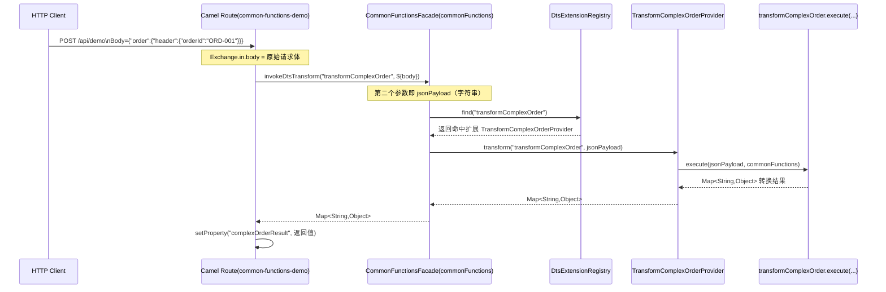

# 24 第三方 DTS 扩展最小模板（可直接复制）

## 1. 目标

本文提供一套可直接复制的最小模板，帮助第三方团队在 10-20 分钟内完成：

- 新建 DTS 扩展工程
- 实现一个 `transformName`
- 打包并投放到 `services/TransformDS`
- 在路由中调用并验证

---

## 2. 目录结构（建议）

```text
your-dts-impl/
  pom.xml
  src/main/java/com/yourcompany/lightesb/dts/spi/OrderRiskProvider.java
  src/main/resources/META-INF/services/com.oureman.soa.lightesb.core.dts.spi.LightesbDtsExtension
```

---

## 3. 最小 `pom.xml` 模板

> 说明：为了让第三方项目只依赖必要能力，模板仅包含 `jackson-databind` 与编译插件。  
> 如果你们已接入内部 SDK/BOM，请按你们的依赖治理规则替换。

```xml
<?xml version="1.0" encoding="UTF-8"?>
<project xmlns="http://maven.apache.org/POM/4.0.0"
         xmlns:xsi="http://www.w3.org/2001/XMLSchema-instance"
         xsi:schemaLocation="http://maven.apache.org/POM/4.0.0 https://maven.apache.org/xsd/maven-4.0.0.xsd">
    <modelVersion>4.0.0</modelVersion>

    <groupId>com.yourcompany.lightesb</groupId>
    <artifactId>order-dts-impl</artifactId>
    <version>1.0.0</version>
    <packaging>jar</packaging>

    <properties>
        <maven.compiler.release>21</maven.compiler.release>
        <project.build.sourceEncoding>UTF-8</project.build.sourceEncoding>
    </properties>

    <dependencies>
        <dependency>
            <groupId>com.fasterxml.jackson.core</groupId>
            <artifactId>jackson-databind</artifactId>
            <version>2.17.2</version>
        </dependency>
    </dependencies>

    <build>
        <plugins>
            <plugin>
                <groupId>org.apache.maven.plugins</groupId>
                <artifactId>maven-compiler-plugin</artifactId>
                <version>3.13.0</version>
                <configuration>
                    <release>${maven.compiler.release}</release>
                    <encoding>${project.build.sourceEncoding}</encoding>
                </configuration>
            </plugin>
        </plugins>
    </build>
</project>
```

---

## 4. 最小 Provider 模板

文件：`src/main/java/com/yourcompany/lightesb/dts/spi/OrderRiskProvider.java`

```java
package com.yourcompany.lightesb.dts.spi;

import com.fasterxml.jackson.core.JsonProcessingException;
import com.fasterxml.jackson.databind.ObjectMapper;
import com.oureman.soa.lightesb.core.dts.spi.LightesbDtsExtension;

import java.util.LinkedHashMap;
import java.util.Map;
import java.util.Set;

public class OrderRiskProvider implements LightesbDtsExtension {

    private static final ObjectMapper OBJECT_MAPPER = new ObjectMapper();

    @Override
    public String id() {
        return "orderRiskProvider";
    }

    @Override
    public int priority() {
        return 100;
    }

    @Override
    public String version() {
        return "1.0.0";
    }

    @Override
    public Set<String> supportedTransforms() {
        return Set.of("transformOrderRisk");
    }

    @Override
    public Map<String, Object> transform(String transformName, String jsonPayload) {
        return transform(transformName, parseJsonToMap(jsonPayload));
    }

    @Override
    public Map<String, Object> transform(String transformName, Map<String, Object> payload) {
        if (!"transformOrderRisk".equals(transformName)) {
            throw new IllegalArgumentException("Unsupported transformName: " + transformName);
        }

        Map<String, Object> result = new LinkedHashMap<>();
        Object amount = get(payload, "order", "payment", "summary", "total");
        double total = toDouble(amount);
        result.put("transform", "transformOrderRisk");
        result.put("orderId", get(payload, "order", "header", "orderId"));
        result.put("total", total);
        result.put("riskLevel", total > 5000D ? "MEDIUM" : "LOW");
        return result;
    }

    @SuppressWarnings("unchecked")
    private Map<String, Object> parseJsonToMap(String jsonPayload) {
        if (jsonPayload == null || jsonPayload.isEmpty()) {
            return new LinkedHashMap<>();
        }
        try {
            return OBJECT_MAPPER.readValue(jsonPayload, Map.class);
        } catch (JsonProcessingException e) {
            throw new IllegalArgumentException("Invalid JSON payload: " + e.getMessage(), e);
        }
    }

    private double toDouble(Object value) {
        if (value instanceof Number number) {
            return number.doubleValue();
        }
        if (value == null) {
            return 0D;
        }
        try {
            return Double.parseDouble(value.toString());
        } catch (NumberFormatException e) {
            return 0D;
        }
    }

    @SuppressWarnings("unchecked")
    private Object get(Map<String, Object> map, String... path) {
        Object current = map;
        for (String key : path) {
            if (!(current instanceof Map<?, ?> currentMap)) {
                return null;
            }
            current = ((Map<String, Object>) currentMap).get(key);
            if (current == null) {
                return null;
            }
        }
        return current;
    }
}
```

---

## 5. SPI 声明文件模板

文件：`src/main/resources/META-INF/services/com.oureman.soa.lightesb.core.dts.spi.LightesbDtsExtension`

```text
com.yourcompany.lightesb.dts.spi.OrderRiskProvider
```

注意：

- 这里必须是**实现类全限定名**
- 多个 Provider 时一行一个

---

## 6. 打包与投放

### 6.1 打包

```bash
mvn clean package
```

产物示例：

- `target/order-dts-impl-1.0.0.jar`

### 6.2 投放

将 Jar 放到：

- `services/TransformDS`

LightESB 默认会扫描该目录（可通过 `lightesb.transformds.*` 配置覆盖）。

---

## 7. 路由调用模板

```xml
<setProperty name="orderRiskResult">
    <method ref="commonFunctions" method="invokeDtsTransform('transformOrderRisk', ${body})" />
</setProperty>
<to uri="servicelog:info?message=orderRiskResult: ${exchangeProperty.orderRiskResult}"/>
```

说明：

- 推荐统一走 `invokeDtsTransform('<transformName>', ...)`
- `transformName` 必须与 `supportedTransforms()` 返回值一致

---

## 8. 参数传递时序（路由到 Provider）

下面以 `transformComplexOrder` 为例，说明从 HTTP 请求体到
`TransformComplexOrderProvider.transform(..., jsonPayload)` 的完整传参路径。



关键点：

- `${body}` 来自 Camel `Exchange` 当前消息体，通常就是 HTTP 请求体
- `method="invokeDtsTransform('transformComplexOrder', ${body})"` 会把 `${body}` 作为第二个实参
- 该实参在 `CommonFunctionsFacade` 中命名为 `jsonPayload`
- 最终传到 `TransformComplexOrderProvider.transform(String, String)` 的 `jsonPayload`
- Provider 再调用 `transformComplexOrder.execute(jsonPayload, commonFunctions)` 完成实际转换

---

## 9. 快速联调步骤

1. 启动 LightESB
2. 观察启动日志是否出现 `TransformDS 扫描完成，当前生效扩展`
3. 调用包含 `invokeDtsTransform('transformOrderRisk', ...)` 的路由
4. 确认返回中包含 `riskLevel`
5. 删除扩展 Jar 再重启，确认行为符合预期（默认回退或按路由异常策略处理）

---

## 10. 常见坑位

- SPI 文件路径写错（最常见）
- SPI 文件内容写成接口名而不是实现类名
- `transformName` 大小写/拼写不一致
- `priority` 冲突导致“以为自己生效，实际被更高优先级覆盖”
- 扩展 Jar 未放在 `services/TransformDS`

---

## 11. 进一步扩展

- 一个 Provider 支持多个转换：在 `supportedTransforms()` 返回多个名称，并在 `transform(...)` 中 `switch` 分发
- 需要覆盖默认 `transformComplexOrder`：声明同名 transform，并设置更高 `priority`
- 需要灰度：并行投放新旧版本 Jar，通过优先级和版本管理策略控制切换

